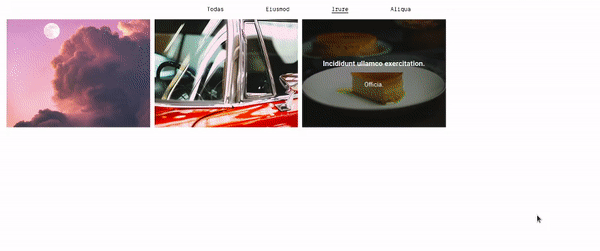

# Categorizador de imagens



Esse é projeto para explorar a biblioteca [react-flip-toolkit](https://github.com/aholachek/react-flip-toolkit).

Supondo que em uma aplicação será passado um estrutura de dados da seguinte forma para a nossa aplicação:

```javascript
  [
    {
      titulo: "Titulo",
      descrição: "Descrição",
      imagem: {...},
      categoria: [
        {
          nome: "Categoria 1",
          descricao: "Essa é uma categoria"
        },
        {
          nome: "Categoria 2",
          descricao: "Essa é uma categoria"
        }
      ]
    },
    {
      titulo: "Titulo",
      descrição: "Descrição",
      imagem: {...},
      categoria: [
        {
          nome: "Categoria 1",
          descricao: "Essa é uma categoria"
        },
        {
          nome: "Categoria 3",
          descricao: "Essa é uma categoria"
        }
      ]
    }
  ]
```

Queremos agrupar esse elementos pelo nome da sua categoria e mostrar com uma bela interface de animação associada.


## Desenvolvimento:

Não será desenvolvido o backend para essa aplicação, pois a intenção é focar na interface.